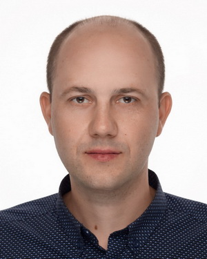

## **Mikalai Kazlou**



#### ***Junior .Net Developer***

---

### **Contacts**

#### *Phone:* +375(33)-630-02-88

#### *Email:* <kazlou.mikalai.s@gmail.com>

#### *LinkedIn:* [mikalai-kazlou](https://www.linkedin.com/in/mikalai-kazlou)

#### *Discord:* Kazlou Mikalai(@mikalaikazlou)

---

### **About myself**

 *I'm Nikolay. I would describe myself as a goal-oriented and hardworking person with a good listening skills. Also, I have always been able to get  on well with different types of people. Working as a developer,  I have developed a number of important skills, including decision-making, multitasking, problem-solving and communication. My goal is to become a full stack developer, so for this I decided to study JS and React or Angular.*

---

### **Skills**

* #### *C\#*

* #### *.Net CORE MVC*

* #### *.Net WebAPI*

* #### *MS SQL Server*

* #### *HTML, CSS, Bootstrap, Kendo UI*

* #### *JavaScript Basics*

* #### *SOLID, DRY, KISS*

* #### *Git, GitHub, GitFlow*

* #### *Visual Studio, VS Code, WebStorm*

---

### **Code Example**

*Complete the solution so that it reverses the string passed into it (codewars).*

```
using System;

public static class Kata
{
  public static string Solution(string str) {
   if (string.IsNullOrEmpty(str))
    {
        return string.Empty;
    }
    else
    {
        char[] strArray = new char[str.Length];
        for (int index = 0; index <= str.Length / 2; index++)
        {
            char replaceChar = str[index];
            strArray[index] = str[str.Length - 1 - index];
            strArray[str.Length - 1 - index] = replaceChar;
        }
        return new String(strArray);
    }
}}
```

---

### **Experience**

* #### *Since 2021 I have been working as a .Net Developer in Republican unitary enterprise «Belenergostroy» – holding management company»* (*Software engineer*)

* #### *Scientific and practical center of NAS of Belarus for mechanization of agriculture* (*Researcher*)

---

### **Projects**

* #### *Work projects:* 
    * Contracts: Analysis and accounting of contracts in construction - (*In development*) ( ASP.Net Core MVC)

    * Authorization Server: Authorization server for login/register users, using OAuth 2.0/OpenID Сonnect - [Authorization Server](https://authsrv.rupbes.by:8011/)  ( ASP.Net Core MVC)

    * ApkSUOT: application for automation of work of labor protection engineers - [ApkSUOT](https://corp.rupbes.by:6969/)  ( ASP.Net Core MVC)


* #### *Courses:* 
     * TaskTracker (team work): a web application for working with a task list, like Trello (*Private repository*) -  ASP.Net Core MVC

     * Currency-app: A currency converter - [Currency-app](https://bitbucket.org/mikalaikazlou/frontendrepository/src/feature-angular-currency-app-kazlou/angular-currency/currency-app/) (JS/Angular)

     * ToDoList – [ToDoList](https://bitbucket.org/mikalaikazlou/frontendrepository/src/feature-angular-todolist-kazlou/ToDoList/) (JS/Angular)

     * Calculator - [Calculator](https://github.com/mikalaikazlou/DOTNET_PROJECT1/tree/master) (JS)

     * Сhatbot: Console application for ordering sushi [Chatbot](https://github.com/mikalaikazlou/DOTNET_PROJECT1/tree/master)  (C#)

---

### **Education**

* #### *Scientific and practical center of NAS of Belarus for mechanization of agriculture* (*Technologies and means of  gricultural mechanization | 2012-2015 (postgraduate study)*)

* #### *Belarusian State Agricultural Technical University* (*Technologies and means of  gricultural mechanization | 2011-2012 (master's degree*))

* #### *Belarusian State Agricultural Technical University* (*Design and production of agricultural machinery | 2006-2011*)

---

### **Courses**

* #### *IT Academy* (*ASP.NET Core MVC | 2020 - 2021*)

* #### *IT Academy* (*C# Development | 2019*)

* #### *IT Academy* (*Basics of Web technologies | 2019*)

---

### **Languages**

* #### *English - Pre-Intermediate*

* #### *Belarusian - Native*

* #### *Russian - Native*
